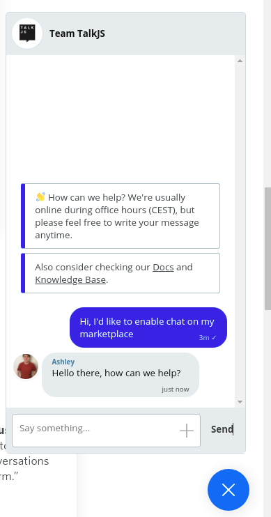
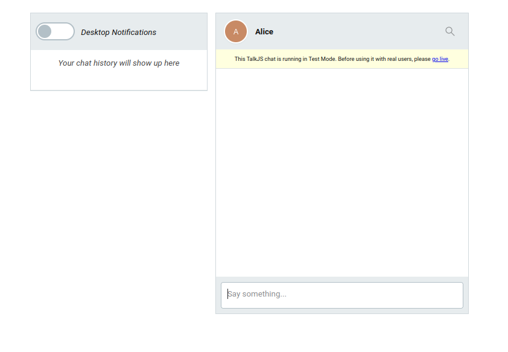
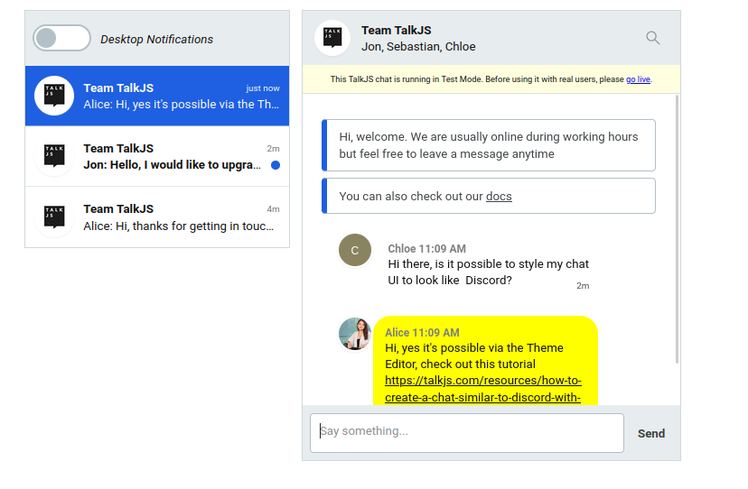
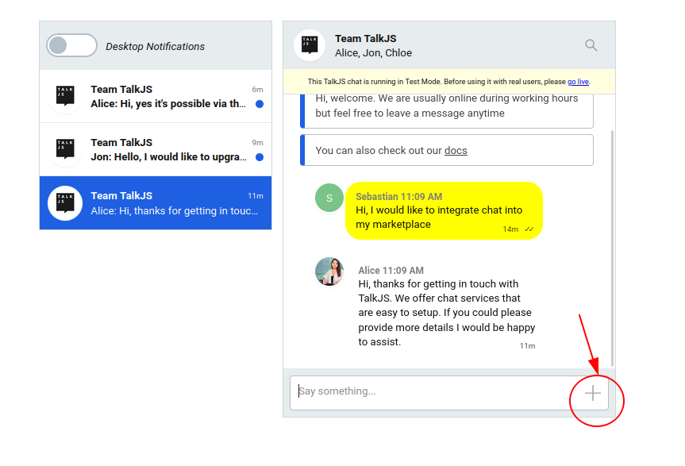
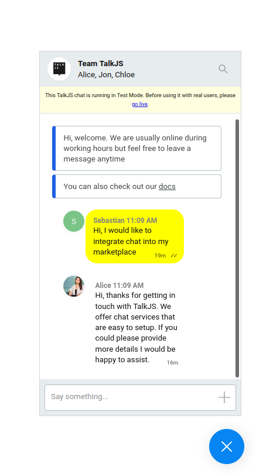

# How to build a custom support chat solution with TalkJS


The [TalkJS API](https://talkjs.com) allows developers to build chat solutions quickly. With TalkJS you can have a chat solution up and running in a matter of hours instead of weeks. TalkJS comes with a configurable, pre-built UI which can be styled and tweaked to meet various use cases. In this tutorial we will build a custom live chat solution with TalkJS.


## Introduction

Developers usually use TalkJs for 1-on-1, group, or [live stream](https://talkjs.com/resources/how-to-build-a-live-comments-section-like-youtube-live/) chat, but today we're going to show you how to make a simple chat for the customer support use case.

The chat will look like the one you see when you visit the TalkJS website. It's shown below.



## Things to Do:
- Set up our chat
- Add features to our chat
- Style our chat

## Setting up our chat

To set up our chat we will follow the [Getting Started](https://talkjs.com/docs/Getting_Started/) instructions in the Docs. This gives us a working inbox which we can then customize. Remember to use your TalkJS **appId**, this is found in the [dashboard](https://talkjs.com/dashboard). Without the TalkJS **appId** the chat will not load. 

### Overview
If you are new to TalkJS this section quickly goes over what we've done so far.

First we embed the script for the TalkJS API in our app. This loads the TalkJS API from the CDN. We also specify a div where the chatbox will be rendered once it's fetched from the CDN.

We then use another script to initiate our chat. This involves defining our users. This is also where we need the appId. One of our users, Alice, is made a current user. This could be the admin or service provider.

We create another user, to whom Alice will talk to, and then create a conversation between the two using a unique ID. Once the conversation is created, we set the participants and then create the chatbox for that conversation. After the chatbox has been created, we mount it inside the div with the id ‘talkjs-container’.

In this case, Sebastian is the person to whom we are talking to. In production, he would be a client who wants to chat with the service provider.

Lastly we create a variable to hold our chatbox and then mount it.

After following these steps our chatbox should look as below:




## Adding Features

To give our customer support a more human feel we want to add a profile picture to our user. To do this we include a `photoUrl` property in the User Object, which is a link to the profile picture. If nothing is specified here, by default it displays the initials of the user.

We can edit our code to this:

```
var me = new Talk.User({
    id: "103489",
    name: "Alice",
    email: "alice@example.com",
    photoUrl: "images/alice.png"
});

```
We also want to add a default message that a customer sees when they open the chat, for example containing a link to docs, availability or other resources. ( Such as you see on the TalkJS livechat). 

To do this we use the `setAttributes` method. [ConversationBuilder.setAttributes](https://talkjs.com/docs/Reference/JavaScript_Chat_SDK/ConversationBuilder/#ConversationBuilder__setAttributes) can also be used to set a subject, and even a display picture of the whole chat, as opposed to the profile pictures on individual participants.

So we can add the following code:

```
conversation.setAttributes({
    subject: "Team TalkJS",
    photoUrl: "https://talkjs.com/images/logo.jpg", // Should be an absolute path
    welcomeMessages: [
        "Hi, welcome. We are usually online during working hours but feel free to leave a message at any time.",
        "You can also check our <https://example.com/docs|docs>" 
    ]
})

```

Our chat will now look like this:

.

At this point let us create 2 more users to simulate a real support conversation. Add the following code: 

```
var other1 = new Talk.User({
    id: '237644',
    name: 'Jon',
    email: 'jon@example.com'
});
var other2 = new Talk.User({
    id: '2267363',
    name: 'Chloe',
    email: 'chloe@example.com'
});

```

After simulating a couple of conversations we will have a screen like this:

.

Additionally we want to allow customers to send attachments. These attachments are tied to user Roles, meaning you can allow certain groups of users to send attachments, while forbidding others. So we navigate to the dashboard and create a new role, let's call it **customer** and then make sure the **Allow file sharing** box is marked.


We should also go back to our user variables and add the `role` property. Our code for the users will now look like this: 

```
var other = new Talk.User({
    id: "854791",
    name: "Sebastian",
    email: "sebastian@example.com",
    role: "customer"
});

```

Our chatbox will now have a small `+` button on the typing field that allows the customer to attach a file, as shown below:



By default our chat is an Inbox UI panel. However for most customer support livechats, the customer sees a popup that can be minimized. We want to implement this popup for the customer facing side of our app, while maintaining the inbox interface for the support staff.

To implement the popup interface we use `Session.createPopup` to create it, and then call it using `mount`.

In our customer facing code we can replace:

```
const inbox = talkSession.createInbox({ selected: conversation });
inbox.mount(document.getElementById('talkjs-container'));
```
with: 

```
const chatPopup = talkSession.createPopup(conversation);
chatPopup.mount({ show: true }); 

```

Our customer facing chat UI is now a popup that looks as shown below:



## Styling
TalkJS comes with a configurable UI and it is up to the developer to tweak it in the Theme Editor to get a particular look. The Theme Editor allows editing using CSS. By targeting relevant  CSS classes, it is fast and easy to make edits in our layouts.

In this tutorial we will only apply minimal styling just to show what is possible.

In our TalkJS dashboard we navigate to Theme Editor and to the ChatHeader Component. 

### The `ChatHeader` Component

The ChatHeader component contains the UI code for the chatbox or inbox header. 

We want to remove the names of the chat participants and only leave the subject. In the Theme Editor templates the names of the participants are rendered as a subtitle of the chat. To remove the subtitle we need to delete line 45:

```
<div class="subtitle">{{ names }}</div>

```
We also want to get rid of the search box, so that our chat looks like the TalkJS one.

In line 52 we can delete the following code, which removes the search icon:

```
<SearchButton t:if="{{ showSearchButton }}" class="action-button">
    <Icon type="search" />
</SearchButton>
```
Our chat pop up will look like this:

.

The service provider backend is still an inbox with the ability to support multiple conversations as shown below:


We have only scratched the surface of what is possible using the Theme Editor, many more possibilities exist. For example, one can style it to look like [WhatsApp](https://talkjs.com/resources/how-to-build-a-chat-app-that-looks-like-whatsapp-with-the-talkjs-chat-api/), or [Discord](https://talkjs.com/resources/how-to-create-a-chat-similar-to-discord-with-talkjs/), or [Slack](https://talkjs.com/resources/how-to-create-a-slack-like-chatbox-with-talkjs-themes/).


## Conclusion

Hope you had a great time coding! We know this is a pretty basic customer support setup but one that will do the job, you can get it working in a few hours and it's working pretty fine for the technical support here at TalkJS".
